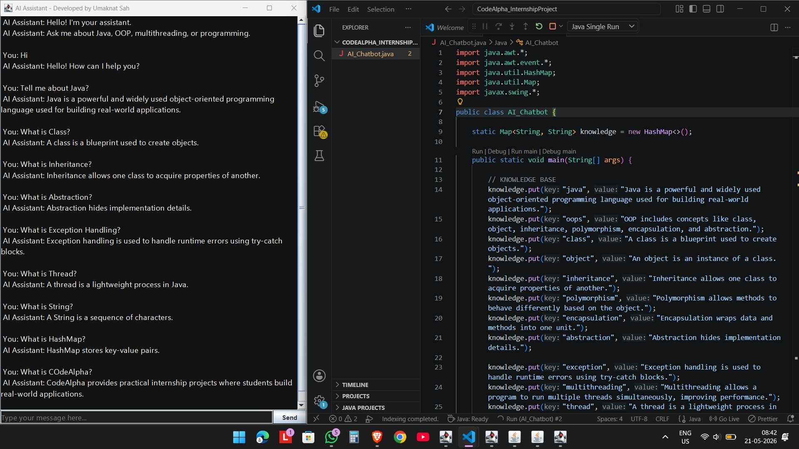

# 🤖 Java AI Chatbot

This is a Java-based AI Chatbot built using Swing GUI.  
It can respond to user queries related to Java, OOP, and programming concepts.

---

## 💡 About the Project

This project is a simple chatbot that uses keyword-based logic to generate responses.  
It helps users understand basic programming concepts through interactive conversation.

Built during my **CodeAlpha Internship** 

---

##  Features

-  Interactive chat interface  
-  Keyword-based smart responses  
-  Multithreading (smooth UI experience)  
-  Input handling and validation  
-  Clean dark theme UI  

---

##  Tech Used

- Java (Core)  
- Java Swing (GUI)  
- OOP Concepts  
- Multithreading  

---

## 📸 Screenshot

---

##  How It Works

- User enters a message  
- Program checks keywords  
- Returns matching response  

---

##  Developed By

Umaknat Sah  
📧 Email: umakantsah943@gmail.com  
💻 GitHub: https://github.com/umakantcoder5333-sketch

---

⭐ If you like this project, feel free to explore and give feedback!
